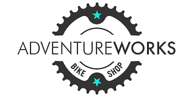
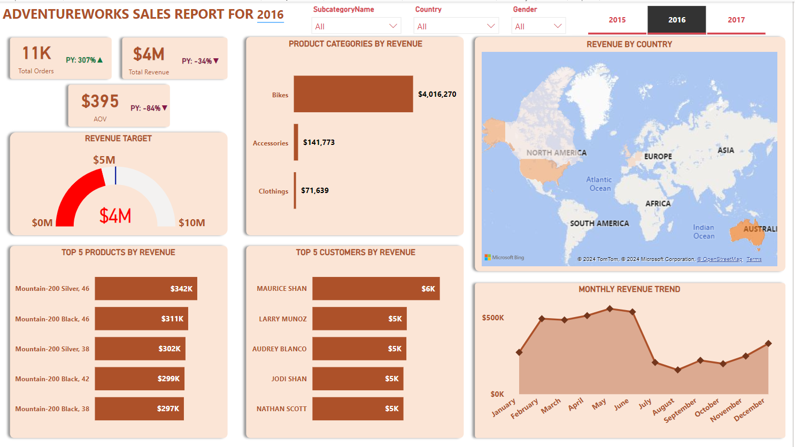

# ADVENTUREWORKS BIKE SALES ANALYSIS
## by Kola Ademola
___

___
# INTRODUCTION
___
This is a data analytics project for Adventure works
## PROBELEM STATEMENT
I tried to solve the following problems with this dataset;
* What is the top products that generated the most revenue?
* Which customer patronized the most?
___
# DATA SOURCING
___
I got this dataset from [Adventure WOrks Dataset Link](https://kaggle.com/awworks)
__
# SKILLS DEMONSTRATED
___
I used SQL to query my database.
___
# ANALYSIS & VISUALIZATIONS
___
This project contains one report page/dashboard.

